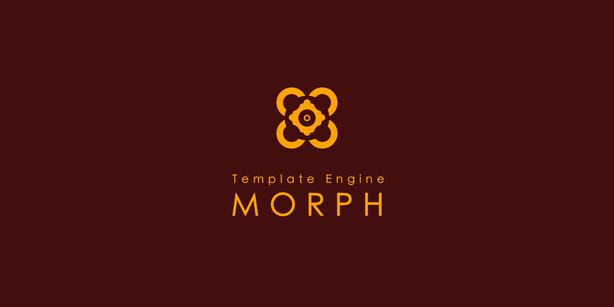

# Morph (@peter.naydenov/morph)


## What's new in version 3.x.x

In version 3 introduced `snippets`, you can choose to render only certain placeholders or groups of placeholders from the template. This lets you use templates as collections of reusable templates, so you can extract and use just the parts you need without having to render the whole template. This makes it easier to create and manage reusable template libraries for your project or rerender only the parts that need to be updated.

The `render` function now takes a command as its first argument. Available commands are: `render`, `debug`, and `snippets`. Other arguments have no changes. Just shifted right. The second argument becomes the data, the third is dependencies, and the fourth is a list of post-processing functions.

In version 3.x.x, the data is always the second argument. It can be a string, as in version 2.x.x. The term "command" is no longer used for this argument; instead, it is called "instructions". Available instructions include: `raw`, `demo`, `handshake`, and `placeholders`.

How to migrate to version 3.x.x, please read the [Migration guide](./Migration.guide.md). Read more about `snippets` down below.


## General Information

`Morph` has a logic-less template syntax. Placeholders are places surrounded by double curly braces `{{ }}` and they represents the pleces where the data will be inserted.

Engine is text based, so it can be used for HTML, CSS, config files, source code, etc.
Some features of Morph:
- Simple logic-less template syntax;
- Builtin storage;
- Powerfull action system for data decoration;
- Demo request can render the template with the builtin data;
- Nesting templates as part of the action system;
- Partial rendering (render only available data);
- Option to connect templates to external data sources;
- Post process plugin mechanism;


## Installation

```
npm install @peter.naydenov/morph
```

Morph can be used in browser and node.js.
```js
import morph from "@peter.naydenov/morph"
// Morph supports also require:
// const morph = require("@peter.naydenov/morph")
```


## Basic Usage

```js
import morph from "@peter.naydenov/morph"

const myTemplateDescription = {
                 template: `Hello, {{name}}!` // simple template - a string with a placeholder
                 , helers : {
                            // helper functions
                        }
                 , handshake : {
                           // ... demo data here
                           name : 'Ivan'
                        }
            }
const myTemplate = morph.build ( myTemplateDescription );      // myTemplate is a render function
const htmlBlock = myTemplate ( 'render', { name: 'Peter' } )   // Provide data to the render function and get the result
// htmlBlock === 'Hello, Peter!'
const demo = myTemplate ( 'render', 'demo' )
// demo === 'Hello, Ivan!'
```

Morph contains also a builtin template storages. Instead of creating variable for each template, we can use the storages.

```js
// add template to the storage. Automatically builds the render function
// Array of two elements. 0 - template name, 1 - optional. Storage name. Defaults to 'default'
morph.add ( ['myTemplate'], myTemplateDescription ) 
// get template from the storage and render it
const htmlBlock = morph.get ( ['myTemplate'] )({ name: 'Peter' }) 
// it's same as text above
morph.add ( ['myTemplate', 'default'], myTemplateDescription )
const htmlBlock = morph.get ( ['myTemplate', 'default'] )( 'render', { name: 'Peter' })
// if we use custom storage:
morph.add ( ['myTemplate', 'hidden'], myTemplateDescription ) // write template in storage 'hidden'
const htmlBlock = morph.get ( ['myTemplate', 'hidden'] )( 'render', { name: 'Peter' }) // render template from 'hidden' storage
morph.get ( ['myTemplate'] )('render', { name: 'Peter' }) // call template 'myTemplate' from default storage
// will return error, because default storage does not have template "myTemplate"
```

Let's see a more complex example before we go into details:
```js
const myTemplateDescription = {
              template: `Hello, {{ person : a, >getReady }}! Your age is {{ person : >getAge}}.` 
            , helpers: {
                            getReady: (person) => {
                                            return {
                                                      text: person.name
                                                    , href: person.web
                                                }
                                        }
                          , a: `<a href="{{href}}">{{text}}</a>`
                          , getAge: (person) => person.age
                    }
             , handshake: {
                        // ... demo data here           
                }
            }
const myTemplate = morph.build ( myTemplateDescription );
const htmlBlock = myTemplate ( 'render', { person: {
                                              name: 'Peter'
                                            , age : 40
                                            , web : 'example.com'
                                        } 
                                })
// htmlBlock === Hello, <a href="example.com">Peter</a>! Your age is 40.
```


## Methods

```js
  build   : 'Build a component from template description'
, get     : 'Get a component from component storage'
, add     : 'Add a component to component storage'
, list    : 'List the names of all components in the component storage'
, clear   : 'Clear up all the components in the storage'
, remove  : 'Remove a template from component storage'
```


## Template Description Structure
Templates are objects with tree properties: `template`, `helpers`, and `handshake`:
```js
const myTemplateDescription = {
      template: `` // (required) Template string
    , helpers: {
                // (optional) Functions and templates used by actions to decorate the data
        }
    , handshake: {
                // (optional) Example data used to render the template.
        }
}
```
`Template` is a string with placeholders where we render our external data. It's a skeleton of the template. Placeholders are the dynamic parts of the template.

Helpers are a extra templates or functions needed for rendering the template. Example:
```js
const myTemplateDescription = {
      template: `
                <h1>{{title}}</h1>
                <ul>
                    {{list:li,a}}
                </ul>
            `
    , helpers: {
                a: `<a href="{{href}}">{{text}}</a>`,
                li: `<li>{{text}}</li>`
            }
    , handshake: {
                title: 'My title'
              , list: [
                          { text: 'Item 1', href: 'item1.com' }
                        , { text: 'Item 2', href: 'item2.com' }
                        , { text: 'Item 3', href: 'item3.com' }
                    ]
            }
}
```
Helpers will be discussed in details in next documentation section - 'Helper Functions'.


## Placeholders

Template placeholders can contain data-source and actions separated by ':'. Data-source is a field of the data object used for the placeholder. Actions describe how the data should be decorated. Action is a list of operations separated by comma. Result from the first action is going as a argument to the second and so on. Executetion of actions is from right to left. Actions are optional.

```js
`{{ name : act2, act1 }}`
// placeholder should take data from field 'name', execute 'act1' and 'act2' over it
// actions are separated by ',' and are executed from right to left

// placeholder could have a name. It's optional and is in the end of the placeholder definition separated by ':'
`{{ name : act2, act1 : placeholderName }}`
// Placeholder names are useful when we want to render only few of them and we preffer to call them by name

`{{ list : li, a }}`
// take data from 'list' and render each element first with 'a' then with 'li' actions

`{{ name }}` // render data from 'name'. Only data is provided to this placeholder
`{{ :someAction}}` // no data, but the result of the action will fill the placeholder
`{{ @all : someAction }}` // provide all the data to the action 'someAction'
`{{:someAction : placeName }}` // action 'someAction' will fullfill content of placeholder and placeholder name will be 'placeName'
```


## Actions

Actions are concise representations of a sequence of function calls. Some functions pertain to `data` manipulation, others to `rendering`, and some to `mixing`. We use a prefix system for enhanced readability and maintainability.

- `Render` functions are most used so they don't have any prefix;
- `Data` functions start with '>';
- `Mixing` functions start with '[]';
- `Conditional render` actions start with '?';
- `Extended render` start with '+';
- `Memory` actions start with '^'. Memory action will take a data snapshot and will be available in helper functions as a named argument 'memory'. The name after the prefix is the name of the snapshot. Request saved data from helper functions by calling 'memory[name]';
- `Overwrite` action is marked with '^^'. Means that the current data will be available for all placeholders, not only for the current placeholder;


Here are some examples: 
```js
`
{{ : li }} // example for render actions
{{ : >setup}} // example for data actions
{{ friends : []coma }} // example for mixing action
{{ list : ul, [], li, a}} // example with render and mixing actions
`
// NOTE: See that mixing function has no name after the prefix. 
// Anonymous mixing is a build in function that will do -> resultList.join ( '' )
// The data will be rendered with 'a', then with 'li'
// then all 'li' elements will be merged and will be provided to 'ul'
```

When input data is array, the result will be an array. Result for each element will stay separated until come the mixing function.

Learn more about how actions work in the section 'helper functions' below.

## Helper Functions

Helpers are templates and functions that are used by actions to decorate the data. Helper functions can be used in templates as actions. Action type explains what to expect from the helper function.

- `Render functions` should return a string - the data that will replace the placeholder. 
- `Data functions` are created to manipulate the data. Expectation is to return data, that will continue to be used by other actions. 
- `Mixing functions` should merge data in a single data result that will be used by other actions.  
- `Extended render functions` will return a string like regular render functions, but will receive a deep branch of requested data;
- `Conditional render functions` could return null, that means: ignore this action. The result could be also a string: the name of other helper function that will render the data.


## Commands
The first argument of the render function is the command. Available commands are: `render`, `debug`, and `snippets`. Default command is `render` so if template doesn't need external information we can call the function without arguments. 


## Snippets
Snippets are a way to render only specific placeholders instead of always rerendering the entire template. Render function arguments were changed in version 3.x.x to serve this purpose. 

How to access snippets:
```js
 const template = {
                template:`
                            <h1>{{title}}</h1>
                            <p>{{description}}</p>
                            <div class="contact">
                                    {{ name : setupName : theName }}
                            </div>
                            <p>{{ tags : +comma : tagList }}</p>
                    `,
                helpers: {
                            setupName : ( {data} ) => `${data.name} ${data.surname}`,
                            comma : ({data}) =>  data.map ( tag => `<span>${tag}</span>` ).join ( ',' )
                        },
                handshake: {
                            title : 'Contacts',
                            description : 'Contact description text',
                            name : { name: 'Ivan', surname: 'Petrov' },
                            tags : ['tag1', 'tag2', 'tag3'],
                        }
          } // template
  
const fn = morph.build ( template );

let res1 = fn ( 'snippets', 'demo' )
// will return a string with the render results of all placeholders separated by '<~>' string
// `Contacts<~>Contact description text<~>Ivan Petrov<~><span>tag1</span>,<span>tag2</span>,<span>tag3</span><~>`
let res2 = fn ( 'snippets:theName', 'demo' )
// will return a string with the render result of 'name' placeholder. No delimiter because is only one placeholder
// `Ivan Petrov`

let res3 = fn ( 'snippets:theName,tagList', 'demo' )
// will return a string with the render results of 'name' and 'tags' placeholders separated by '<~>' string
// `Ivan Petrov<~><span>tag1</span>,<span>tag2</span>,<span>tag3</span>`

// snippets can be accessed also with index - starting from 0. Index mean the order of appearance of placeholders in the template.
let res4 = fn ( 'snippets:2,3', 'demo' )
// it's the same as res3. Use names or indexes according to your preferences. With indexes placeholder will not need to have a name.
```


## Experimentals

### `.morph` File Extension

Describe Morph templates within `.morph` file extensions. Available after version 3.5.x. This allows you to create the template files with HTML-like syntax, CSS modules, and JavaScript helpers. During the build process, vite plugin will extract the template, helpers, and handshake data from the file, will compile it to function and will save as ES module, ready to import from other files. CSS support comes as extension of what Morph can do. Writing a Morph file that contains only CSS will be converted to CSS file. In morph files that contain mix of HTML, CSS, and JavaScript, the CSS will be converted to CSS modules.

A `.morph` file contains four separate sections.

The four sections are:
- **Template (HTML)** - The main template with Morph syntax
- **Script (JavaScript)** - Helper functions and logic
- **Style (CSS)** - CSS with automatic module scoping
- **Handshake (JSON)** - Demo data for testing

Example `.morph` file structure:
```html
<!-- Template (HTML) -->
<div class="card">
  <h2>{{ title : formatTitle }}</h2>
  <p>{{ description : truncate }}</p>
  <h3>Items</h3>
  {{ items : ul, [], renderItem }}
  <button data-click="save">Save</button>
</div>


<script>
// Place for helpers
// Function definition
function formatTitle ({ data }) {
            return data.toUpperCase();
    }

function truncate ({data}) {
            const length = 100;
            return data.length > length ? data.substring(0, length) + '...' : data;
    }

// Template definition
let renderItem = `<li>{{name}}</li>`;
let ul = `<ul>{{text}}</ul>`
</script>

<style>
.card {
        background: var(--card-bg, #fff);
        padding: 1rem;
        border-radius: 8px;
    }
</style>

<script type="application/json">
// Script with type: application/json
// Handshake - Place for demo data
{
  "title": "Card Title",
  "description": "Card description",
  "items": [
            { "name": "Item 1" },
            { "name": "Item 2" },
            { "name": "Item 3" }
        ]
}
</script>
```

Get started with the official Vite plugin:
**GitHub Repository:** [vite-plugin-morph](https://github.com/PeterNaydenov/vite-plugin-morph)

Once configured, you can directly import `.morph` files in your code:
```js
import myTemplate from './templates/my-template.morph'

// The imported template is ready to use
const result = myTemplate ( 'render', { name: 'Peter' })
```


### VSCode Extension

For better development experience with `.morph` files, you can install the official VSCode extension that provides syntax highlighting:

**Extension Name:** [Morph Template Syntax Highlighting](https://marketplace.visualstudio.com/items?itemName=PeterNaydenov.morph-template-syntax-highlighting)

Install directly from the VSCode Marketplace or search for "Morph Template Syntax Highlighting" in your VSCode extensions panel.


## Links
- [Release history](Changelog.md)
- [ Migration guide ](https://github.com/PeterNaydenov/morph/blob/master/Migration.guide.md)
- [ Vite Plugin ](https://github.com/PeterNaydenov/vite-plugin-morph)
- [ VSCode Extension ](https://marketplace.visualstudio.com/items?itemName=PeterNaydenov.morph-template-syntax-highlighting)


## Credits
'@peter.naydenov/morph' was created and supported by Peter Naydenov.

## License
'@peter.naydenov/morph' is released under the MIT License.


